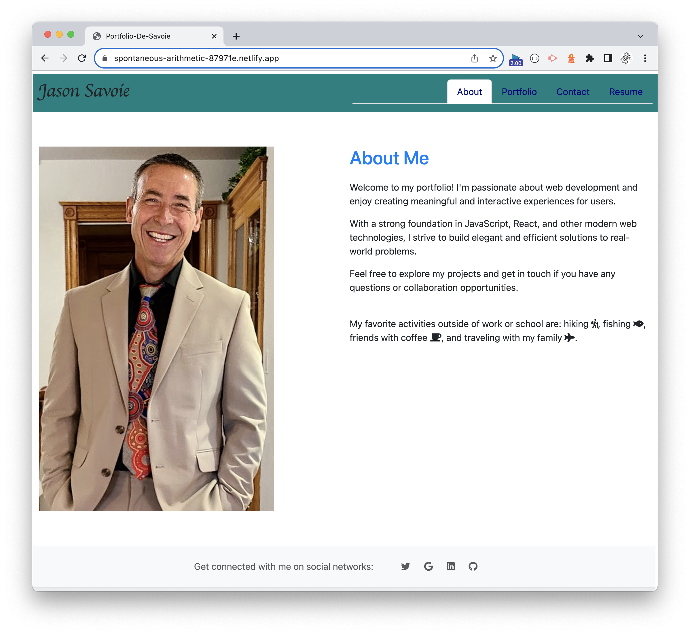
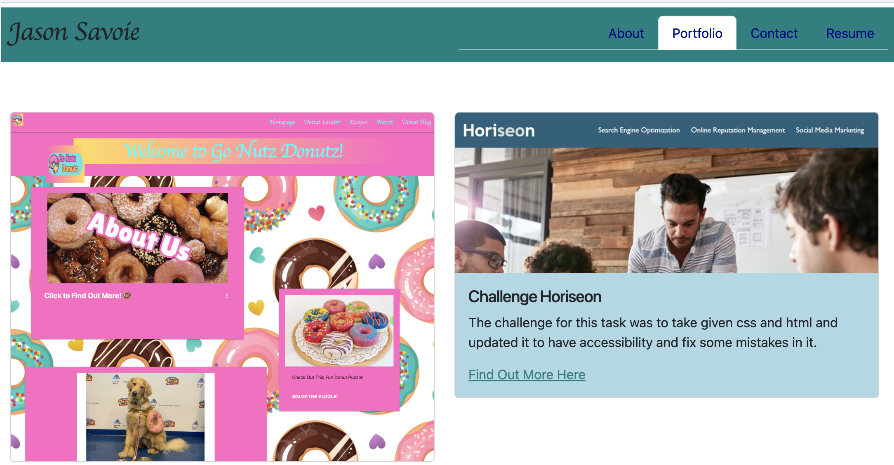
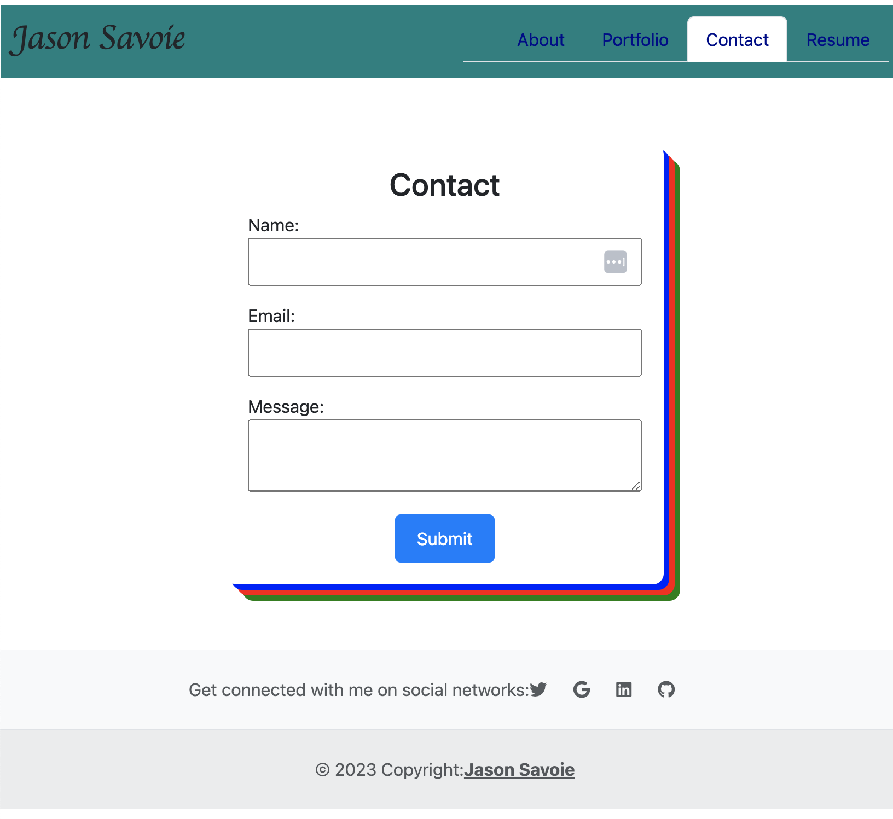
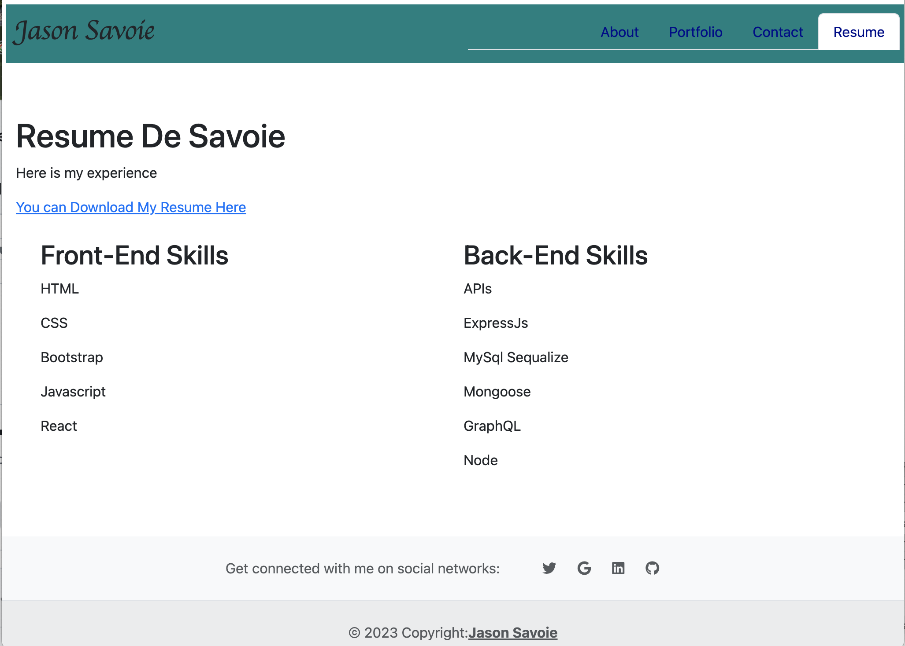

# portfolio-de-react
My portfolio done using react

## Description

The purpose of this repo, application and readme is to show that a portfolio can be created in react as well as with normal HTML/CSS. This is the first react-run application deployed to netlify.com that allows the visitor to see who I am, what projects I've worked on, contact me and view my skills and download my resume.

When you go to the site, you will be presented with an About page. It shows a little bit about me. There are multiple tabs at the top you can go to that include: A portfolio of projects, a way to Contact me, and my Resume/Skill set. At the bottom of the page are other ways to follow me on LinkedIn, Twitter or Github.

You can visit the deployed site here on Netlify.

*  [You can visit the ***DEPLOYED SITE HERE on Netlify***:](https://spontaneous-arithmetic-87971e.netlify.app/)

* Here is a gander of what you will see when you visit the site
. 

## Motivation for this application

What a great opportunity this was to use some of the skills we learned for React and Vite to be used in running a portfolio site. Good experience in actually creating something from scratch and seeing how it comes together.

## Table of Contents

* [Technology Used](#technology-used)
* [Repo Location](#repo)
* [Screenshots of Application](screenshots-of-application)
* [Learning Points](#learning-points)
* [Code Snippets](#code-snippets)
* [Contact Info](#contact-info)
* [Psuedo Code](#psuedo-code-for-this-project)

## Technology Used 

The server side of things is deployed using Vite; The main engine running all of the pages is through React JS; and the styling is done through multiple libraries of bootstrap. This was merely to see that React is so widely ingrained in so many things. 
<br>
The stylings uses include: 
* Fontawesome
* MDBootstrap
* Bootstrap (getbootstrap.com)
* React-Bootstrap

| Technology Used         | Resource URL           | 
| ------------- |:-------------:| 
| ViteJS | [https://vitejs.dev/guide/](https://vitejs.dev/guide/)     |    
| ReactJS | [https://react.dev/](https://react.dev/)     |    
| bootstrap | [https://getbootstrap.com/](https://getbootstrap.com/)     |    
| React-Bootstrap | [https://react-bootstrap.netlify.app/](https://react-bootstrap.netlify.app/)     |    
| Fontawesome | [https://www.npmjs.com/package/@fortawesome/fontawesome-free](https://www.npmjs.com/package/@fortawesome/fontawesome-free)     |    
| Netlify | [https://www.netlify.com/](https://www.netlify.com/)|
| Git | [https://git-scm.com/](https://git-scm.com/)     |    

And Typical:
* Google Search
* Youtube university 
* ChatGPT to verify code and troubleshoot.

## Repo 

[GitHub Repo for my Portfolio-De-React](https://github.com/flimits/portfolio-de-react)
<br>
[Netlify Deployment can be found here](https://spontaneous-arithmetic-87971e.netlify.app/)


## Screenshots of Application
---
There are 4 main places to land on the site. The About page is the first

### Here is the opening page.

---
---
### Next would be the Portfolio of Projects worked on of the last few months

---
---
### A Contact(s) page where you can send me a note

---
---
### Lastly there is a Resume tab for the, er ... the thing .. that

---
---

## Learning Points and Lessons learned

Projects that force you to write the code from scratch are unique in that they give you more to research and work with, debug, cry about, and generally struggle to figure out even the simplest of things. This was not a huge project, yet there this is new. ReactJs and ViteJs are new to me, so seeing how they work together was fun.
<br>
After the main engine is up and running along with the routes and general layout, then can the struggle (as it were) to learn how React styling works. Fortunately, our instructor had a ton of examples and explained things really well (plus TA's and Tutors are great)

## Code Snippets

Let's take a look at the most worked on parts of the code here. Starting with ReactJS and ViteJS.

### ViteJS vite.config.js 

1. Vite is standard build for developement of this server. The config file gets created when you install it. Here is what it looks like. The PORT can be changed if needbe.
```js
import { defineConfig } from 'vite'
import react from '@vitejs/plugin-react'

// https://vitejs.dev/config/
export default defineConfig({
  plugins: [react()],
  server: {
    port: 3000,
    open: true,
  },
});

```

2. The index.html page is a bare-bones file that really only need one thing to run with React, and that is 

```js
  <body>
    <div id="root"></div>
    <script type="module" src="/src/main.jsx"></script>
  </body>
```
Where you can at least add a title to the page, but the key is the ```id="root"```

3. The main.jsx file is the beginning of entry into the application. Here we createBrowserRouter configured for several paths (about, portfolio ...etc).

```js
const router = createBrowserRouter([
  {
    path: '/',
    element: <App />,
    errorElement: <Error />,
    children: [
      {
        index: true,
        element: <About />,
      },
      {
        path: '/Portfolio',
        element: <Portfolio />,
      },
      {
        path: '/Resume',
        element: <Resume />,
      },
      {
        path: '/Contact',
        element: <Contact />,
      },
    ],
  },
]);
ReactDOM.createRoot(document.getElementById('root')).render(<RouterProvider router={router} />);
```
4. The layout component for React in the App.jsx file where the React Router is setup using the ```<Outlet />``` component.
```js
function App() {
    return (
        <>
            <NavBar />
            <main className="mx-3" style={{ paddingBottom: '60px' }}>
                <Outlet />
            </main>
            <Footer />
        </>
    )
}
      
```

4. Without getting too deep into the woods, there are the pages for each of the tabs with the page:
* About.js
* Contact.jsx
* Portfolio.jsx
* Resume.jsx

<br>

Along with components for the Footer and NavBar.


## Contact Info

| Name      |Email      | Github    | Portfolio |
|-----------|-----------|-----------|-----------|
|Jason       |flimits@gmail.com|https://github.com/flimits|https://github.com/flimits/my-portfolio/|

## Deployment
| Name      |Hosting      | Deployment Site    | 
|-----------|-----------|-----------|
|Portfolio-de-react       | Netlify.com |https://spontaneous-arithmetic-87971e.netlify.app|


## Psuedo Code for this project

If you wish to look at some basic Psuedo coding that was done to help start this project, the main parts are in TODO within these files:
```
src/js/database.js
webpack.config.js
```

##  Pseudo code Session

The following is a Pseudo-coding session the class team did together in order to work on this project.

* Refer to the first activity to create a React application using Vite
* package.json has some default scripts - add what you want
* Create Portfolio - how?
* Component Breakdown (src)
  * main.jsx - routing- incl. react-router-dom?
  * App.jsx - what's on every page? navbar(link, using router), header, footer 
  * /assets - img files, resume file
  * /components
    * Splash/Landing for home route (optional)
    * Header
      * NavBar.jsx - selected page needs to be highlighted
    * About.jsx - Photo & Bio
    * Contact.jsx - form with name, email, message (functional? not necessarily, NPM's available to do so)
      * acceptance criteria: fields required, validation, etc.
    * Resume.jsx - resume document downloadable, list of skills
    * Portfolio/Projects.jsx Container - iterate with project card list
      * Project Card 
    * Footer - links to awesome stuff[linkedin, github, medium blog]
    * Clicky stuff

    * Deploying to Netlify
